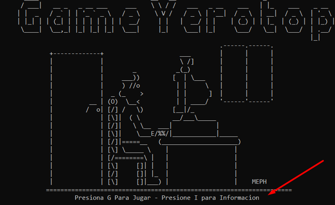

# UT4 - Proyecto Jerobel

## Indice

1. Descripción
2. Elementos
3. Funcionamiento

## Descripción

El desarrollo de mi videojuego está basado en un Rogue Legacy, el cual se trata de un jugador el cual cuenta con una máximo de vidas y que las va perdiendo a medidas que se va moviendo. Para ello, deberá de encontrar una llave e ir hasta la salida, pero no será tan fácil ya que contará con enemigos persiguiéndole de cerca.

En la siguiente imagen, podremos ver gran parte de nuestro mapa pudiendo identificar todos los objetos creados en este. Los Items que identificamos son el elemento “D” que se identifica de color azul el cual se le es asociado a los Diamantes, juntos con la “O” de color amarillo que engloba a las monedas que debe recolectar el jugador.

Identificadas con flechas de color rosa, podremos ver de color verde a las serpientes las cuales mantienen un movimiento líneas secuencial, de color gris los Golem que mantienen un movimiento aleatorio y de color morado los Slenderman los cuales mantienen una IA según la posición del jugador y que hará seguimiento a este.

De color cyan las flechas, veremos los elementos identificados bajo el display “\#” que hacen referencia a las rocas las cuales deberá romper el jugador para poder obtener la llave.

## Elementos

### Arrays de Objetos

Realizamos el uso de los Arrays de los objetos, directamente en la creación del mapa. Este está constituido por el objeto celda el cual es equivalente en referencia a un Pixel del mapa completo. Gracias a este objeto conseguimos un conjunto de celdas “Pixeles” y obtenemos un Tablero “mapa” de forma total.

### Clases Estáticas

Las clases estáticas hacemos uso de ellas a la hora de declarar el tipo de celda el cual se trata, es decir cada pixel de la pantalla puede mantener un significado estático en referencia y de forma independiente a otro existente, inclusive si estuviese juntos ya que estos son objetos independientes conjuntados por un Arrays como comentábamos en el apartado anterior.

Nuestros Pixeles o el objeto celda, puede encontrarse declarado bajo diferentes modalidades como lo son \(Suelo, Muro, Roca, Salida, Vidas, Herrero\)

### Herencia de Clases

En nuestro juego, podremos encontrarnos clases con herencias directamente sobre los objetos de los Items los cuales son dropeados por el mapa. En este podremos ver las pociones, los diamantes y finalmente la llave la cual actúa de objeto que nos permite la salida de la dungeon.

En esta clase hereditaria, la herencia se realiza sobre un método Display\(\);

### Interfaces

Las Interfaces las utilizamos directamente sobre los objetos enemigos los cuales serán la verdadera amenaza existente. Estas interfaces serán las cuales se le heredarán de forma obligatoria a los objetos ligados a esta los métodos Display\(\) y Mover\(\).

### Array List

El uso de ArrayList, lo encontraremos directamente sobre el inventario con el que contará el Jugador, este mantiene una mochila la cual puede ser rellenada de los objetos que mantiene la Herencia de objetos.

Este ArrsyList, en mi caso lo he limitado a un máximo de 10. Este ArraList es declarado en la clase Inventario.

### String

La Clase String, la declaramos directamente en el Program de nuestro Juego, en esta lo que realizamos es la lectura de un documento externo de texto, que introducimos en la clase String para hacer lectura de este.

## Funcionamiento

### Portada

Mi Portada u menú de inicio, lo podremos apreciar directamente desde el arranque del Juego, donde el jugador podrá identificar el logo del Juego creado, junto a una serie de instrucciones que desee, es decir, iniciar el juego o poder observar una serie de resumen u instrucciones del juego.

Este lo podremos ver de la siguiente manera:

### Movimiento del Jugador

El jugador, contará con diferentes movimientos libres, pero a su vez, contará con diferentes obstáculos. Los movimientos del jugador se realizan directamente desde el apartado de Program Cuando el jugador realiza un movimiento, para no realizar la repetición de las condiciones, crearemos una condición general llamada Move\(\) que registra las últimas coordenadas del jugador transformándolas por las nuevas según los datos obtenidos gracias a las variables entrantes de incX y incY.

El jugador podrá contar con ciertos obstáculos como puede ser la limitación del juego o directamente con la limitación de los muros donde el jugador solamente podrá desplazarse por los tipos de celdas que mantengan un valor diferente a WALL.

Deberemos de tener en cuenta que el jugador si puede ejecutar desplazamiento sobre los Items existentes o sobre los enemigos permitiendo así la colisión de estos.

### Generación del mapa

Como decíamos anteriormente, el mapa identificado en la clase Tablero es el conjunto del objeto Celdas, de igual forma esto lo comentábamos en puntos anteriores donde realizábamos un Array con esta clase ya mencionada que metafóricamente se identifica a un Pixel.

Lo primero que realizamos es la ejecución del mapa de forma completa, identificado unos tamaños fijos.

Nuestro jugador no podrá hacer comprobación del tablero de forma completa, es por ello que generemos una llamada a Ventana, donde será la parte del mapa que puede observar el jugador y por donde hace el desplazamiento.

Esta la he limitado a una ventana de \[50,30\], donde realizamos un doble bucle para simular la creación de pequeños cachos de mapas junto a una zona prohibida que será la intuición de los bordes del juego.

Esta a su vez, nos permite que el jugador al realizar un movimiento no sea el jugador el que realiza el desplazamiento si no que visualmente se lo parezca, siendo el propio tablero el que lo realiza.

### Condiciones de Inicio

El jugador comenzará por defecto con cantidad de vida fija estipulada en 200, una dureza del pico la cual es un intervalo aleatorio que se encuentra asociado a un Random de 100 y una cantidad de monedas y diamantes a su vez fija.

El jugador solamente podrá hacer uso de la salida si contiene la llave y localiza la salida a tiempo antes de desangrarse, ya que este pierde vida por cada movimiento o por el afrontamiento contra un enemigo.

Si esta se queda a 0, es equivalente a ¡Game Over¡

### Enemigos

Como he comentado en los apartados anteriores, contamos con tres enemigos diferentes, el primero de ellos es llamado gusano que mantiene un movimiento lineal de forma horizontal, este es aleatorio en su comienzo y una vez choque gira para seguir su continuación.

Otro de ellos es el enemigo Golem, el cual mantiene un movimiento aleatorio siempre y cuando este sea diferente a WALL.

Por último, identificamos el enemigo Slenderman, que realiza movimientos según la posición del Jugador principal contando con una IA de seguimiento.

Todos estos al colisionar con el Jugador, se le es restado a esta -10 puntos de vida. La diferencia entre ellos es el Slenderman que una vez colisiones aparte de restar puntos de vida, se quedará quieto durante 10 movimientos ya que si no haría seguimiento del jugador de forma continua.

